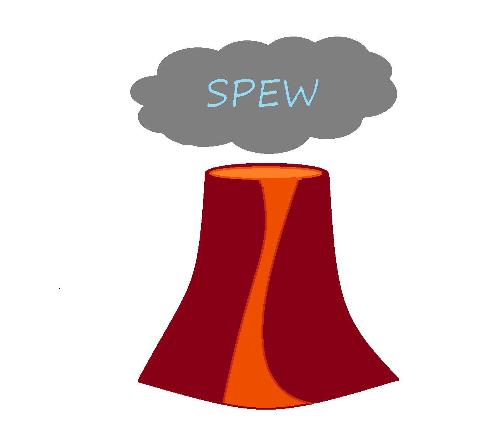

# SPEW
[Style Guide](http://adv-r.had.co.nz/Style.html)
[Markdown Cheatsheet](https://github.com/adam-p/markdown-here/wiki/Markdown-Cheatsheet)

SPEW stands for *S*ynthetic *P*opulations and *E*cosystems of the *W*orld, and is a `R` package which generates synthetic populations. 

# Description
SPEW works by combining three primary pieces of data:
	1. Microdata
	2. Population Counts
	3. Shapefiles
to form a synthetic population of some region in the world.

SPEW was initially formed to create household and people populations for each tract in the United States but has since been extended to over 20 other countries in the world.  To date, over one billion individuals have been synthesized.

The populations were made in mind for use in as agents in agent based models such as in [FRED](http://fred.publichealth.pitt.edu/), which models the spread of the flu in the US.

# Functions
SPEW can handle common types of microdata such as from the US PUMS and IPUMS-I, but can also handle custom data, provided the data is in the right format.  We provide functions to help put your data in the right format to use with SPEW.

In addition to the populations, we also provide diagnostic plots and functions to provide summary data.

Our populations from SPEW and prior versions can be found at [epimodels.org](http://www.epimodels.org/drupal/?q=node/32).
# Usage and Examples

# Process
## Read
## Format
## Make
