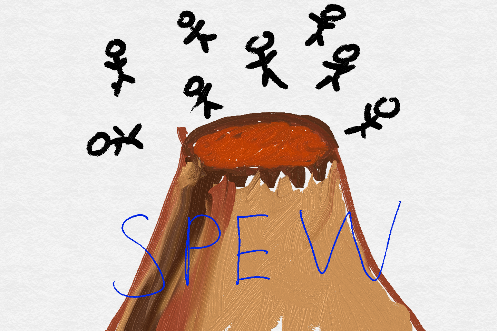

# SPEW
[Style Guide](http://adv-r.had.co.nz/Style.html)
[Markdown Cheatsheet](https://github.com/adam-p/markdown-here/wiki/Markdown-Cheatsheet)

Synthetic Populations and Ecosystems of the World

# Usage

# Examples

# Process
## Read
## Format
## Make
